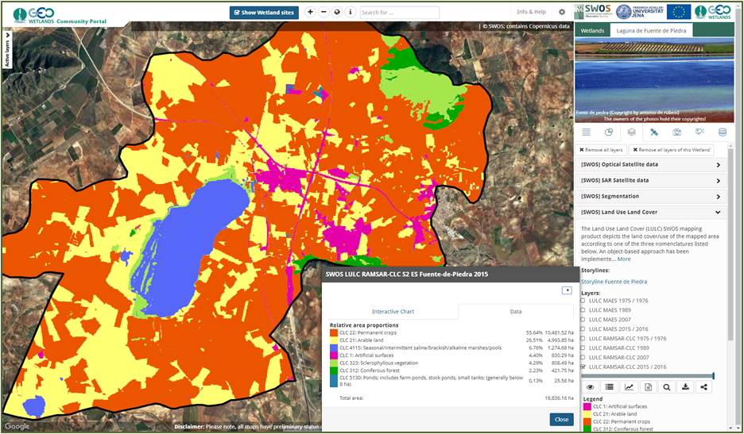
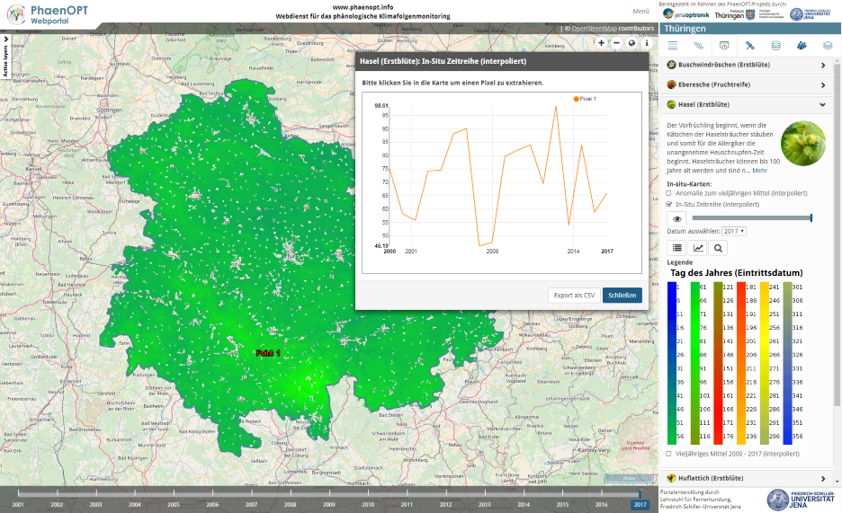
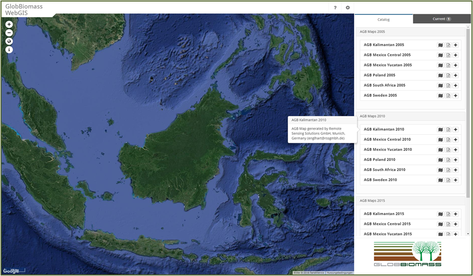
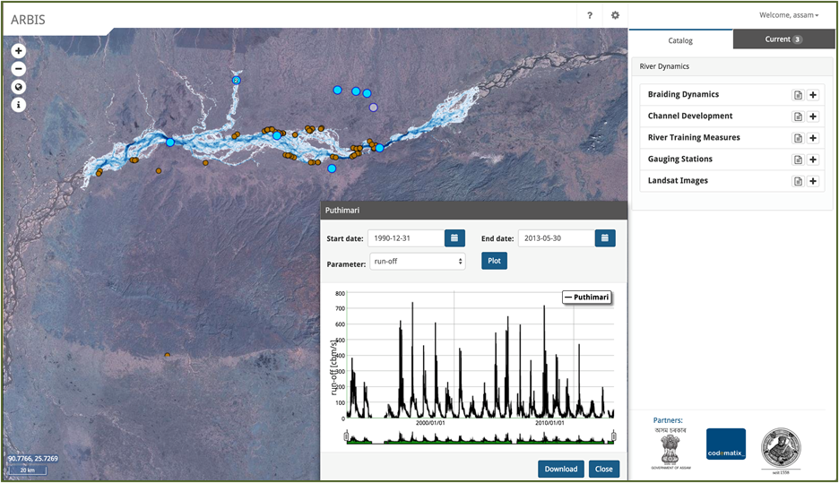

# Geoportal WebGIS framework using Python Django

**Objectives:**
* Develop a generic framework to set up web-based geoportals using existing open source web frameworks
* Publish independent map viewers with centralized data management
* Provide ability to automatize the discovery of multi-source Earth Observation data for individual regions

**Tools:**
* Interactive visualization of geospatial data based on OGC services
* ISO-compliant metadata management and publication
* Satellite scene explorer
* Time-series data extraction services

**Main open source software used:**
* Django Web Framework (Python) with Django REST framework and GeoDjango
* AngularJS
* OpenLayers
* Bootstrap CSS

**Further information:**
* [Eberle et al. (2018): "Automated Earth Observation data discovery and access using open source web frameworks". Poster at EGU 2018 conference, Vienna.](docs/Eberle_EGU2018.pdf)

**Open issues:**
* Provide sample database dump file
* Further source code cleanup and documentation
* Activate issues in this repository
* Provide Dockerfile

## Examples

### GEO-Wetlands Community Portal - Wetland observations from space
http://portal.swos-service.eu


### PhaenOPT.info - phenological maps for Thuringia, Germany
http://phaenopt.info (coming soon)


### GlobBiomass WebGIS


### ARBIS - Assam River Basin Information System


## Setup

### Backend setup (old)
```
# install python2 versions of pip and virtualenv

$ cd path/to/cloned-repo
# create a virtualenv
$ virtualenv --python=python2 venv
# activate the virtualenv
$ source venv/bin/activate
# install all packages listed in requirements.txt
$ pip install -r framework/requirements.txt
```
### Backend setup (new 2024)
```
# clone repo
git clone https://github.com/geofranzi/geoportal.git
# install python3 venv
apt install python3.10-venv
# install venv 
python3 -m venv /opt/geoportal/venv_3_10
source venv_3_10/bin/activate
cd geoportal/requirements/
pip install -r local.txt  # production.txt on server
```

### Database setup (with backup file)
```
$ createdb -U <dbUser> <database>
$ psql <database> < dump.db
```

### Database setup (without backup file, based on Django migrations)
```
$ createdb -U <dbUser> <database>
$ source venv/bin/active
$ python manage.py makemigrations
$ python manage.py migrate
```

### Frontend setup
```
# install npm (preferrably via distro package manager)

$ cd path/to/cloned-repo
## install all packages listed in npm-shrinkwrap.json and packages.json
$ npm install
```

### Django setup
```
$ vi webgis/settings.py
Adjust DATABASES dictionary
Adjust SUBDIR according to your Apache configuration

$ python manage.py collectstatic
Yes, files can be overwritten
```

### Apache WSGI
```
$ vi index.wsgi
Adjust your local virtual environment directory
Adjust PYTHONPATH to framework and webgis directory

$ vi /etc/apache2/sites-available/default
WSGIScriptAlias /swos2 /home/sibessc/workspace/swos/master/framework/index.wsgi
Alias /swos2/static/ /home/sibessc/workspace/swos/master/framework/static/

$ sudo apache2ctl -k graceful
Restart apache "gracefully"
```

## Django Configuration
Prior to any mapviewer request you need to edit the mapviewer and adjust the template selection, because complete path is stored in the database!

## Frontend maintenance
For a list of required, external JavaScript libraries, see `packages.json`. For a detailed list of required, external JavaScript libraries and their dependencies, including exact version numbers, see `npm-shrinkwrap.json`. For a list of actually included JavaScript and CSS files, see `framework/mapviewer/assets.py`.

Required JavaScript and CSS files are bundled and minified via the Django app "django-assets". The configuration of these bundles is done in `framework/mapviewer/assets.py`, Django is configured to search in `framework/static` and in `node_modules` for the given files. Bundles are stored in `static/build`, which is ignored by git.

Most libraries only have JavaScript or CSS code, but some also come with fonts or images. These additional files have been copied from the libraries' `node_modules` to our `static` directory, while keeping the directory structure intact. At the moment, this applies to the following libraries:

* Bootstrap
* Font Awesome
* Fancybox

### Debugging
During development, bundling and minification might be undesired. It can be easily disabled by setting `ASSETS_DEBUG=True` in `settings.py`. In production mode, this should be changed to `FALSE`.

### Library installation/updates

When installing/updating a library, it is necessary to check, if the library has font files, images etc. that have to be copied into our `static` directory.

```
# installing a library + saving in npm-shrinkwrap.json and packages.json
npm install --save "jquery@1.12.4"

# check, which packages can be updated
# current: installed version
# wanted: latest version taking version constraint from packages.json into account
# latest: actual latest version (might have breaking changes!)
npm outdated

# updating a library to the latest minor + saving in npm-shrinkwrap.json and packages.json
npm update --save "jquery"
```

### Bundling/Bundle configuration

To include JavaScript or CSS files, they have to be added to the right bundle in `framework/mapviewer/assets.py`. The idea is to have 4 file lists containing all files required by all Mapviewers:
- baseVendorJs: external JavaScript files
- baseAppJs: our own AngularJS files
- baseVendorCss: external CSS files
- baseAppCss: our own CSS files

These 4 lists serve as the base for defining bundles specific for a Mapviewer. E.g. bundles for a Mapviewer called "foo" would look like this:
- baseVendorJs + foo-specific JS files => fooVendorJsBundle
- baseAppJs + foo-specific app JS files => fooAppJsBundle
- ...


## Anchors to wetlands and products
#/wetland/4/ --> open wetland with id 4  
#/wetland/4/product/ --> open wetland with id 4 and select products  
#/wetland/4/product/1932 --> open wetland with id 4, select product, add layer with id 1932 and open menu  
#/wetland/4/product/2551_1932 --> open wetland with id 4, select products, add layer with id 2551 and 1932 and open menu (type (e.g. "product") should fit to last layer id --> #/wetland/4/externaldb/1932_2551 )


## Anchors to story lines
#/storyline/2 --> open story line with id 2  
#/storyline/2/2 --> open story line with id 2 part 2
